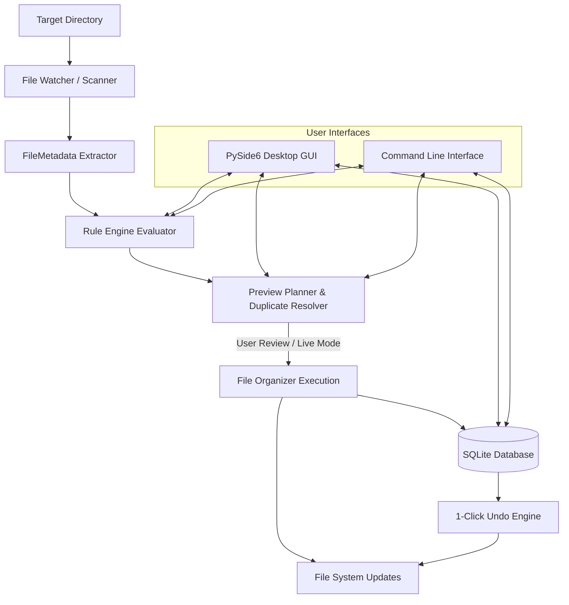

<div align="center">


# 📂 DropSort — Intelligent File Organizer

[](https://python.org)
[](https://doc.qt.io/qtforpython/)
[](https://github.com/NeelSavsani/DropSort/releases/latest)
[](LICENSE)
[](#-testing)

**DropSort** automatically organizes files into the right folders based on extension, filename patterns, file type, modification date, and fully customizable user-defined rules — with a **live preview** before anything moves, and **one-click undo** if it doesn't.

### 📥 [Download DropSort for Windows (Click Here)](https://github.com/NeelSavsani/DropSort/releases/latest)

</div>

---

## ✨ Why DropSort?

Most file organizers just do this:
```python
if extension == ".jpg":
    move_to("Images/")
```
That's a script, not a system. DropSort instead evaluates **multiple conditions per file** — extension, filename pattern (regex/glob), date modified/created, file size, and semantic categories — against a configurable rule engine, so a single file can be routed based on everything it knows about it, not just its extension.

### Before vs. After

```text
Downloads/ (Before)
├── IMG_1234.jpg
├── invoice_august_2026.pdf
├── setup.exe
├── song.mp3
├── report.xlsx
├── movie.mp4
├── python.zip
└── resume.pdf
```

```text
Downloads/ (After DropSort)
├── Images/2026/
│   └── IMG_1234.jpg
├── Documents/
│   ├── Invoices/2026/
│   │   └── invoice_august_2026.pdf
│   └── resume.pdf
├── Applications/
│   └── setup.exe
├── Music/
│   └── song.mp3
├── Spreadsheets/2026/
│   └── report.xlsx
├── Videos/
│   └── movie.mp4
└── Archives/
    └── python.zip
```

---

## 🧠 How It Decides

DropSort matches each file against your rules top-down, combining conditions with **AND / OR** logic:

```text
WHEN extension = "pdf" AND filename MATCHES REGEX "(?i)invoice"
THEN move → "Documents/Invoices/{year}/"
```

| File | Extension | Filename Match | Date | File Category | Destination |
| :--- | :--- | :--- | :--- | :--- | :--- |
| `invoice_august_2026.pdf` | `pdf` | contains `"invoice"` | Aug 2026 | Documents | `Documents/Invoices/2026/` |
| `IMG_1234.jpg` | `jpg` | — | 2026 | Images | `Images/2026/` |
| `report.xlsx` | `xlsx` | — | 2026 | Spreadsheets | `Spreadsheets/2026/` |
| `python.zip` | `zip` | — | — | Archives | `Archives/` |
| `setup.exe` | `exe` | — | — | Applications | `Applications/` |

> [!NOTE]
> Rules are evaluated in **priority order** (10, 20, 30...), and the **first full match wins** — so you can stack a specific rule (`invoice*.pdf`) above a general fallback (`*.pdf`).

---

## 🚀 Features

- 🔍 **Multi-Condition Rule Engine**: Match on extensions (single or list), filename substring, regex patterns, glob patterns, file sizes (e.g. `> 10MB`), modification dates (`within_days`, `before_date`, `after_date`), and 9+ semantic file categories.
- 👀 **Interactive Live Preview**: Review every planned file movement in an interactive table with checkboxes. Nothing is touched silently.
- 📡 **Real-Time Folder Watching**: Background `watchdog` daemon monitors target folders (e.g., `Downloads/`), automatically debouncing write locks and download buffers (`.crdownload`, `.part`, `.tmp`).
- ♻️ **Configurable Duplicate Handling**: Choose per rule or globally between **Rename** (`file (1).pdf`, `file (2).pdf`), **Replace** (atomic overwrite), or **Skip**.
- ↩️ **1-Click History & Undo**: Every move is recorded in SQLite. Reverse any single file move or rollback an entire batch session with a single click.
- 🖥️ **Desktop GUI (PySide6)**: Modern dark-mode interface featuring Dashboard KPI cards, Visual Rule Builder, Live Rule Sandbox Tester, Staging Preview, and History logs.
- ⚙️ **Headless & Scriptable CLI**: Run `--simulate` (dry-run with colorized table), `--run` (immediate organization), `--watch` (daemon), and `--undo` directly in your terminal or scripts.
- 🔒 **100% Local & Private**: No files, metadata, or paths ever leave your machine.

---

## 🏗️ Architecture



---

## 📦 Installation

```bash
# Clone the repository
git clone https://github.com/<your-username>/DropSort.git
cd DropSort

# Create a virtual environment
python -m venv venv
# Windows:
venv\Scripts\activate
# Linux / macOS:
# source venv/bin/activate

# Install dependencies
pip install -r requirements.txt
```

---

## ▶️ Usage

### 🖥️ Desktop GUI Mode
Launch the full dark-mode graphical user interface:
```bash
python main.py
```

### ⚙️ Headless / Scripted CLI Mode

```bash
# 1. Dry run — shows what would happen in a colorized table without moving files
python main.py --simulate --path "D:/Downloads"

# 2. Apply rules immediately once
python main.py --run --path "D:/Downloads"

# 3. Start continuous folder monitoring daemon
python main.py --watch --path "D:/Downloads"

# 4. Undo the last organization batch
python main.py --undo last

# 5. Undo a specific batch ID
python main.py --undo 6299dfe5-224a-4ef1-901f-0fc9faaf28c7

# 6. List all configured rules and priorities
python main.py --list-rules
```

---

## ⚙️ Configuring Rules

Rules are saved in `rules.json` (or can be customized visually in the GUI):

```json
{
  "rules": [
    {
      "id": "rule-invoices",
      "name": "Invoices & Receipts",
      "priority": 10,
      "enabled": true,
      "when": {
        "logical_operator": "AND",
        "conditions": [
          { "field": "extension", "operator": "equals", "value": "pdf" },
          { "field": "filename", "operator": "matches_regex", "value": "(?i)(invoice|receipt|bill)" }
        ]
      },
      "then": {
        "destination": "Documents/Invoices/{year}/",
        "action_type": "move",
        "on_duplicate": "rename"
      }
    },
    {
      "id": "rule-photos",
      "name": "Photos by Year",
      "priority": 20,
      "enabled": true,
      "when": {
        "logical_operator": "OR",
        "conditions": [
          { "field": "file_type", "operator": "equals", "value": "Images" },
          { "field": "extension", "operator": "in_list", "value": ["jpg", "jpeg", "png", "heic"] }
        ]
      },
      "then": {
        "destination": "Images/{year}/",
        "action_type": "move",
        "on_duplicate": "rename"
      }
    }
  ]
}
```

### Dynamic Destination Template Tokens

| Token | Description | Example Output |
| :--- | :--- | :--- |
| `{year}` | 4-digit modification year | `2026` |
| `{month}` | 2-digit modification month | `08` |
| `{month_name}` | Full month name | `August` |
| `{day}` | 2-digit day | `24` |
| `{date}` | ISO Date (`YYYY-MM-DD`) | `2026-08-24` |
| `{time}` | Time (`HH-MM-SS`) | `14-30-00` |
| `{ext}` | File extension (no dot) | `pdf` |
| `{name}` | Full filename | `invoice_2026.pdf` |
| `{base_name}` | Filename stem (no extension) | `invoice_2026` |
| `{category}` | Semantic category | `Documents` |
| `{size_human}` | Human readable size | `1.5 MB` |

---

## 🧪 Testing

DropSort includes a test suite covering the rule engine, template expansion, duplicate resolution, SQLite migrations, 1-click undo rollbacks, watcher debounce, CLI parsing, and GUI layout initialization:

```bash
pytest
```

---

## 📄 License

This project is licensed under the [MIT License](LICENSE).
